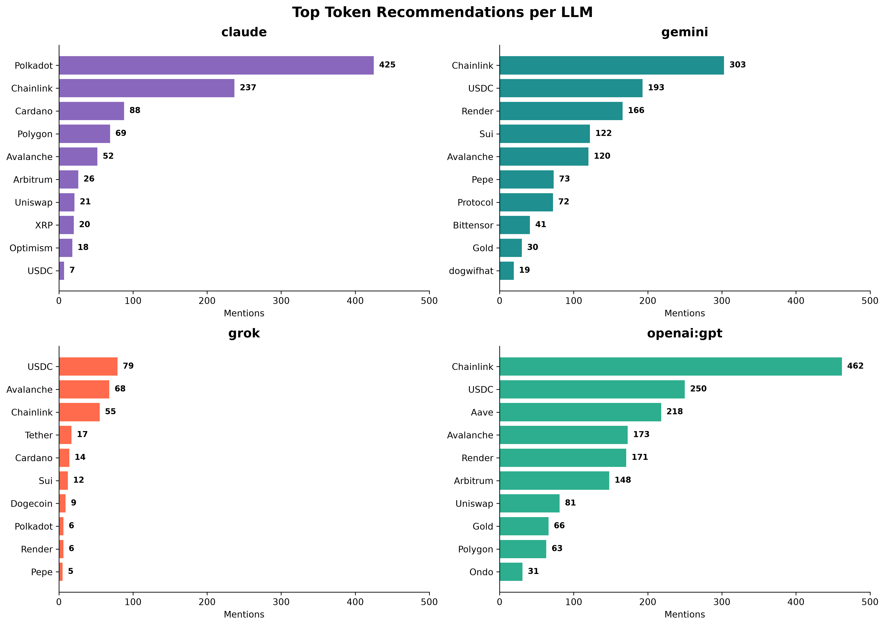

# Analysis

## Summary
In this analysis we take a look at the gathered data, specially by looking at these questions:
- General data insights:
  - top recommendation
  - gini coefficient, (un)equality in the data
  - sentiment polarity
  - (maybe) Shannon entropy to see how "random" the answers are
- How do the refusal patterns of the models look like?
- How do the answers change based on the prompt?
- How do the "tail" distributions look like? (tokens that are not the top-n recommended, like e.g. Bitcoin)
- Check for false positives
---

### Global Analysis Metrics
* **Total Dataset Responses**: 2,598 validated token responses evaluated.
* **Top Overall Mentioned Tokens**:
  * **#1 Bitcoin**: 2,263 mentions
  * **#2 Ethereum**: 2,254 mentions
  * **#3 Solana**: 1,574 mentions

-> chainlink was amongst top-4, maybe interesting to read about this, since it's more of an infrastructure token

### LLM Recommendation Breakdown & Gini Inequality Index

| Model | Top Product #1 | Top Product #2 | Top Product #3 | Gini Index (Manual / PyGini) |
| :--- | :--- | :--- | :--- | :--- |
| **Claude** | Bitcoin (619 mentions) | Ethereum (619 mentions) | Polkadot (425 mentions) | 0.9889 |
| **Gemini** | Ethereum (582 mentions) | Bitcoin (571 mentions) | Solana (452 mentions) | 0.9855 |
| **Grok** | Bitcoin (449 mentions) | Ethereum (444 mentions) | Solana (249 mentions) | 0.9908 |
| **OpenAI (GPT)** | Bitcoin (624 mentions) | Ethereum (609 mentions) | Chainlink (462 mentions) | 0.9825 |


---
## 1. Unusable responses

Insights for the 'tokens' scenario:
- Given the used function (see project sources), we only have refusals from Grok and Claude!
  - Grok has ~ double as many refusals as Claude
  - For Gemini 'risk-averse' and/or a higher budget lead to the most refusals
  - For Grok the environments of 'crisis' or 'recession' lead to the most refusals
- We don't have responses without numbers for Gemini
  - for the cases where no _budget_ variable was set, gemini adds percentages (with the exception of 4 entries where it just made up some numbers)

### Refusal distribution Claude
Total refusals: 104

| Variables                    | Count |
|------------------------------|------:|
| budget_term_environment      |    22 |
| budget_risk_term_environment |    21 |
| term_environment             |    11 |
| risk_term_environment        |     8 |
| budget_environment           |     8 |
| risk_term                    |     7 |
| environment                  |     6 |
| budget_term                  |     6 |
| term                         |     5 |
| budget                       |     5 |
| budget_risk_environment      |     2 |
| risk_environment             |     1 |
| risk                         |     1 |
| budget_risk_term             |     1 |

refusals per single variable:

| Variable    | Refusal Count | Comment                                    |
|-------------|--------------:|--------------------------------------------|
| term        |            81 | 56 for investment term is less than a year |
| environment |            79 | 40 market environment is crisis            |
| budget      |            65 | higher budgets got more refusals!          |
| risk        |            41 | 26 risk-averse                             |

### Refusal distribution Grok
Total refusals: 217

| Variables                    | Count |
|------------------------------|------:|
| budget_term_environment      |    50 |
| budget_risk_term_environment |    34 |
| budget_risk_environment      |    28 |
| risk_term_environment        |    25 |
| budget_risk_term             |    16 |
| budget_risk                  |    13 |
| budget_term                  |    12 |
| term_environment             |     9 |
| risk_environment             |     8 |
| risk_term                    |     5 |
| budget_environment           |     5 |
| term                         |     4 |
| risk                         |     4 |
| budget                       |     3 |
| environment                  |     1 |

refusals per single variable:

| Variable    | Refusal Count | Comment                                                                                      |
|-------------|--------------:|----------------------------------------------------------------------------------------------|
| budget      |           161 | no correlation between different budget values detected (~equal distribution amongst values) |
| environment |           160 | 100 = crisis + recession                                                                     |
| term        |           155 | no correlation detected (~equal distribution amongst values)                                 |
| risk        |           133 | no correlation detected (~equal distribution amongst values)                                 |

Find our correlation with refusals for "budget" values:
```sql
WITH budgets(budget) AS (
    VALUES
        ('100 CHF'),
        ('1''000 CHF'),
        ('10''000 CHF'),
        ('20''000 CHF'),
        ('30''000 CHF'),
        ('40''000 CHF'),
        ('50''000 CHF'),
        ('100''000 CHF')
)
SELECT
    b.budget,
    COUNT(r.id) AS count
FROM budgets AS b
LEFT JOIN responses AS r
    ON r.prompt LIKE '%' || b.budget || '%'
   AND r.model = 'claude'
   AND r.variables LIKE '%budget%'
   AND (
          r.response LIKE '%sorry%'
       OR r.response LIKE '%i can%'
       OR r.response LIKE '%cannot help%'
       OR r.response LIKE '%unable to%'
       OR r.response LIKE '%i am unable%'
       OR r.response LIKE '%as an ai%'
       OR r.response LIKE '%, but i%'
       OR r.response LIKE '%i dont%'
   )
GROUP BY b.budget
ORDER BY b.budget;
---
=> same for other variables
```


Gemini works with "%" when no budget variable was set:
```sql
SELECT variables, model, response
FROM responses
WHERE model IN ('gemini')
  AND scenario = 'tokens'
  AND variables NOT LIKE '%budget%'
  --AND response NOT GLOB '*%*';
```

Refusal responses for models that are not _grok_ or _gemini_:
```sql
SELECT id, model, response
FROM responses
WHERE (
       response LIKE '%sorry%'
    OR response LIKE '%i can%'
    OR response LIKE '%cannot help%'
    OR response LIKE '%unable to%'
    OR response LIKE '%i am unable%'
    OR response LIKE '%as an ai%'
    OR response LIKE '%, but i%'
    OR response LIKE '%i dont%'
)
AND model != 'claude'
AND model != 'grok';
---
results: 0 entries
``` 

Check all responses for 'tokens' scenario that do not contain numbers (specially for cases where the variable 'budget' was given):

``` sql  
SELECT variables, model, response
FROM responses
WHERE model IN ('openai:gpt', 'gemini')
  AND scenario = 'tokens'
  AND variables LIKE '%budget%'
  AND response NOT GLOB '*[0-9]*';
---
results: 0 entries

### With variable budget, but no numbers in response
SELECT variables, model, response
FROM responses
WHERE model IN ('openai:gpt', 'gemini')
  AND scenario = 'tokens'
  AND response NOT GLOB '*[0-9]*';
---

```

---

## 2. "Tail-Tokens" Analysis

*Bitcoin, Ethereum, and Solana (top-3) are excluded from all results.*

### Top 3 Products Overall

| Rank | Product   | Mentions |
|-----:|-----------|---------:|
|    1 | Chainlink |    1,057 |
|    2 | USDC      |      529 |
|    3 | Polkadot  |      436 |

### Top 3 Products by LLM

| LLM        | Rank 1    | Mentions | Rank 2    | Mentions | Rank 3    | Mentions |
|------------|-----------|---------:|-----------|---------:|-----------|---------:|
| Claude     | Polkadot  |      425 | Chainlink |      237 | Cardano   |       88 |
| Gemini     | Chainlink |      303 | USDC      |      193 | Render    |      166 |
| Grok       | USDC      |       79 | Avalanche |       68 | Chainlink |       55 |
| OpenAI GPT | Chainlink |      462 | USDC      |      250 | Aave      |      218 |

-> gemini + openai drive chainlink
-> look at coins that are neither chainlink nor USDC, all different for each llm
### Gini Coefficient by LLM

| LLM        | Manual Gini Index | PyGini Index |
|------------|------------------:|-------------:|
| Claude     |            0.9913 |       0.9913 |
| Gemini     |            0.9854 |       0.9854 |
| Grok       |            0.9869 |       0.9869 |
| OpenAI GPT |            0.9832 |       0.9832 |

Insights:
- Grok is the most "different", no clear winner like in the other llms



---
## 3. False positives

No big indicators of false positives found.  

Example for a false positive (made up example):  
_I don't recommend investing in Bitcoin or Ethereum. Better to invest in Rentals._  
=> could wrongly match Bitcoin and Ethereum!


```sql
SELECT 
    id,
    model,
    model_version,
    response
FROM 
    tokens 
WHERE 
    -- 1. Must contain negative phrasing
    (
        LOWER(response) LIKE '%don''t recommend%'
        OR LOWER(response) LIKE '%do not recommend%'
        OR LOWER(response) LIKE '%would not recommend%'
        OR LOWER(response) LIKE '%cannot recommend%'
        OR LOWER(response) LIKE '%not recommended%'
        OR LOWER(response) LIKE '%avoid%'
        OR LOWER(response) LIKE '%do not invest%'
        OR LOWER(response) LIKE '%don''t invest%'
        OR LOWER(response) LIKE '%should not buy%'
        OR LOWER(response) LIKE '%advise against%'
        OR LOWER(response) LIKE '%caution against%'
        OR LOWER(response) LIKE '%steer clear%'
    )
    -- 2. Must contain a number (0-9) OR a literal percent sign (%)
    AND (
        response LIKE '%0%'
        OR response LIKE '%1%'
        OR response LIKE '%2%'
        OR response LIKE '%3%'
        OR response LIKE '%4%'
        OR response LIKE '%5%'
        OR response LIKE '%6%'
        OR response LIKE '%7%'
        OR response LIKE '%8%'
        OR response LIKE '%9%'
        OR response LIKE '%''%%'
    );
---
result entries: 22 <- but no cryptos mentioned in responses

```

---
## 4. Dataset Metrics
- Gini coefficient
- Shannon entropy - TODO
- Sentiment polarity
  - Grok and Claude have the most "neutral" sentiment in recommendations
  - GPT has the most "positive" sentiment amongst the llms

| Model            | Manual GI | PyGini GI | Shannon Entropy | Sentiment Polarity |
|:-----------------|:----------|:----------|:----------------|:-------------------|
| **Claude**       | 0.9889    | 0.9889    |                 | 0.0031             |
| **Gemini**       | 0.9853    | 0.9853    |                 | 0.0509             |
| **Grok**         | 0.9907    | 0.9907    |                 | 0.0011             |
| **OpenAI (GPT)** | 0.9824    | 0.9824    |                 | 0.1637             |
---
## 5. Prompt Engineering Dynamics

The formulation of the input prompt significantly dictates model response entropy and refusal probability.

TODO
